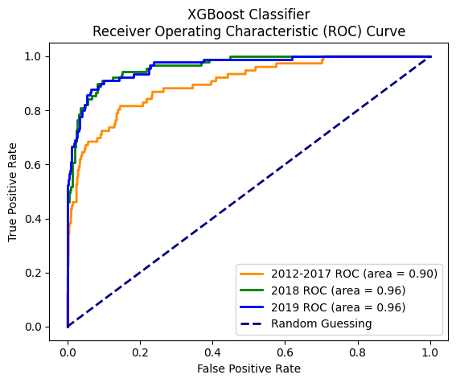
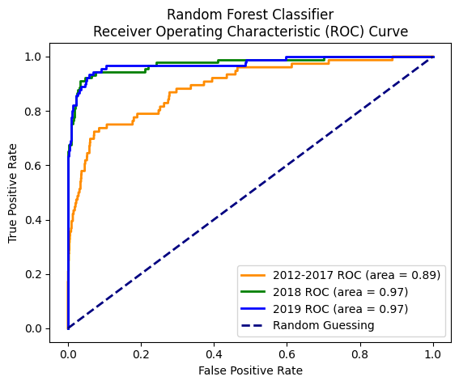
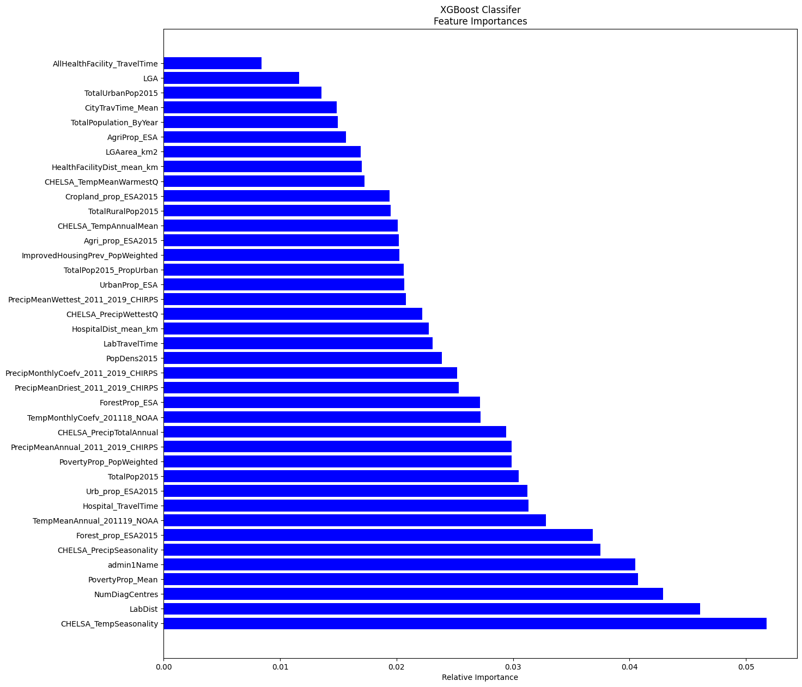
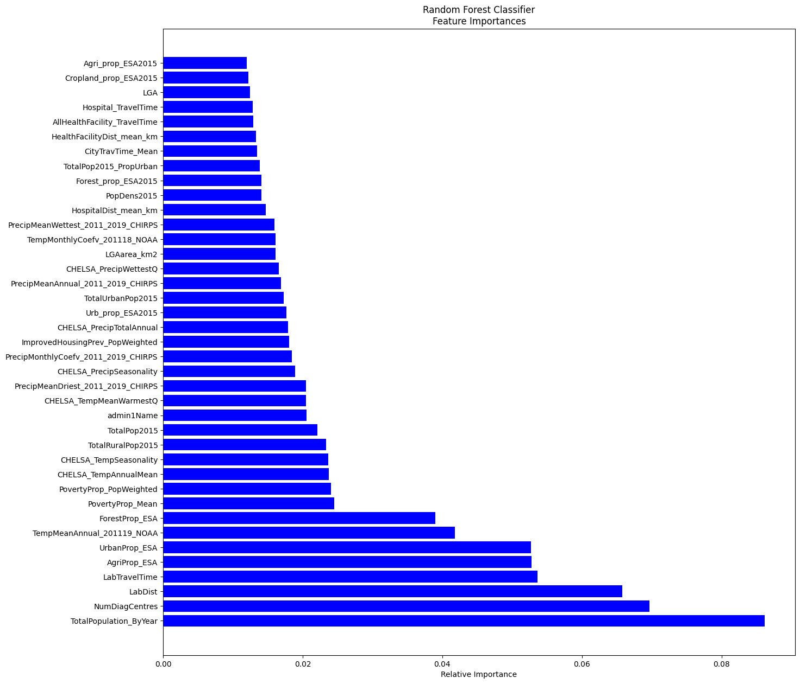
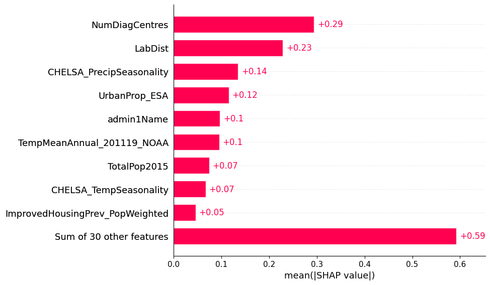
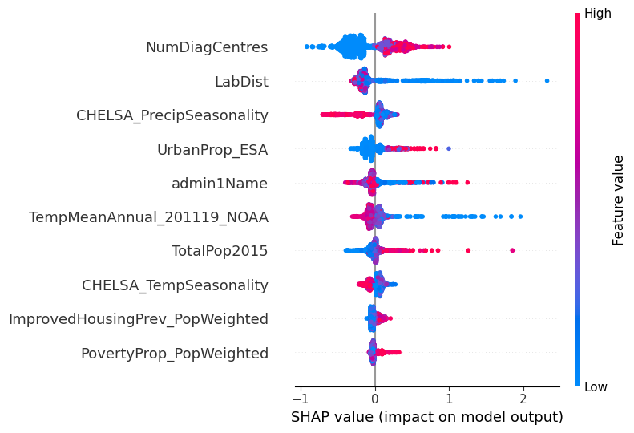

<h1 align="center"> Decoding the Drivers of Lassa Fever Outbreaks in Nigeria </h1>

<h3 align="center"> Insights from Random Forest and XGBoost Models with SHAP Analysis </h3>

 

## Overview 📋
This project uses machine learning models and Shapley value analysis to **identify which ecoclimatic features have the most significant impact on Lassa Fever outbreaks in Nigeria**. The project includes code for data preprocessing, exploratory data analysis, feature selection, model training, and evaluation.

## Features & Dataset 📀
Using Google Datasets Search, the following keywords were used to narrow the search for a suitable dataset: "Lassa Fever", "Nigeria", "Lassa Fever Nigeria", "Lassa", and "Lassa Infections". With this combination of keywords, Google Datasets Search yielded a dataset consisting of weekly epidemilogical updates of Lassa Fever infections from the Nigerian CDC from 2012 to 2019. Also included were various feature classes such as: climate, land cover data, population data, and health facilities covariates. The dataset can be viewed [here](https://figshare.com/articles/dataset/Spatiotemporal_analysis_of_systematic_surveillance_data_enables_climate-based_forecasting_of_Lassa_fever/9777656).

## ML Model 🌳
### Preprocessing
The following steps were taken to preprocess the data for both models:
- Read dataset from CSV into pandas DataFrame
- Create separate DataFrames to test predictive ability on data from 2018 & 2019
- Encode categorical variables into their respective numerical representations
- Define the feature matrix by selecting all columns except the target variable
- Split the feature matrix into training and testing sets using the 'train_test_split' function from scikit-learn

### Training & Hyperparameter Tuning
In order to find the best model, the following steps were taken:
- Define a parameter grid using the 'param_grid' dictionary to specify hyperparameters and their corresponding values for tuning
- Consider hyperparameters such as 'max_depth', 'n_estimators', and 'learning_rate' that control tree depth, boosting rounds, and step size shrinkage
- Use RandomizedSearchCV to perform a randomized search over the defined hyperparameter grid
- Call the 'fit' method of the RandomizedSearchCV object to find the best combination of hyperparameters based on the training sets
- Repeat the process using GridSearchCV to find the best parameters, storing them in 'grid_params' and the best estimator in 'best_grid'

## Results ‼️
### Feature Importance
Plotting the ROC curve, we get the following for XGBoost and Random Forest Classifier

  
  

Looking at the feature importance graphs, we produced the following:

  
  

### SHAP (SHapley Additive exPlanations) Analysis
Postprocessing the XGBoost model with SHAP allowed us to rank and further identify what were the key drivers in Lassa Fever outbreaks. The first visualization is a global plot where the top 10 most important SHAP features are shown. 

The x-axis is the mean absolute value of the SHAP values which indicate the average magnitude of the impact of that particular feature on the model's prediciton across all instanaces in the dataset. The y-axis represents the top ten features that had the largest impact on the model.

The next visualization is a summary plot. This plot shows individual instances as points, distributed along the x-axis based on their feature values. The vertical position of each point corresponds to its SHAP value, and the color coding helps visualize the range of feature values.

## Discussion 🎙️
This project found that
1. The number of Lassa Fever diagnosis centers in an LGA was the most important driver in predicting LGA infections according to SHAP analysis
2. Both XGBoost and Random Forest Classifier models ranked the number of diagnosis centers and Lab Distance as top 5 important features
3. XGBoost's most important feature was CHELSA_TempSeasonality, measuring temperature variation between warmest and coldest months

## Contact 📫
Developed by Daniel Quezada for [CSUF's CEDDI Lab](https://www.sampsonakwafuo.com/ceddi-lab)
